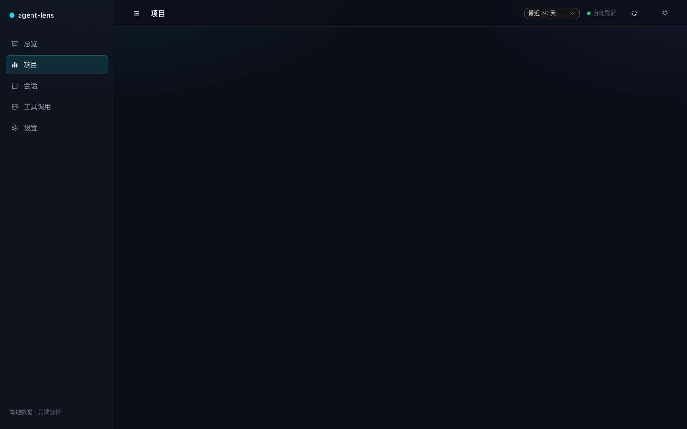
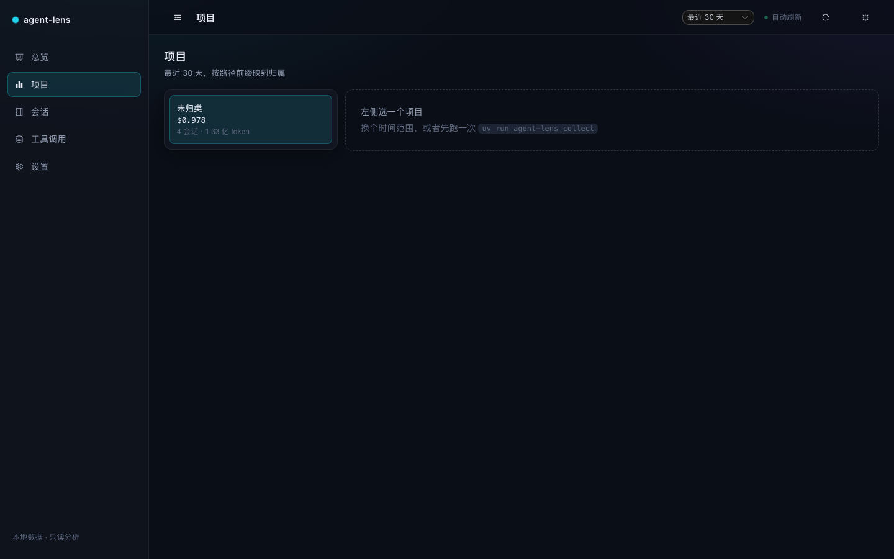

# 已知问题

发现即记录；**未标注「已修复」的都还没动过代码**。

## KI-1 · 点击左侧导航切换页面时内容区空白，刷新后才显示

| | |
|---|---|
| 记录时间 | 2026-09-28 |
| 状态 | **未修复**（按要求只记录，不动代码） |
| 报告人 | 用户（本地实机操作发现） |
| 定位 | 已定位到根因（见下），修复方案已列但**未实施** |
| 环境 | `docker compose up` 的 `web` 服务：生产构建 + FastAPI 同源托管，http://localhost:8000 |

### 现象

1. 打开 http://localhost:8000/ ，总览页正常。
2. 点击左侧任一导航项（项目 / 会话 / 工具调用 / 设置）。
3. 右侧内容区变**空白**：侧栏、顶栏、页面标题都正常更新（点「项目」标题就是「项目」），
   只有内容没了。
4. 在该地址按浏览器刷新，内容恢复正常。
5. 白屏之后再点别的导航项也回不来——一旦坏掉就是坏的，只有刷新能救。

| 点击导航后 | 刷新后 |
|---|---|
|  |  |

### 根因（已用 Playwright 实测确认）

`<Transition>` **只能包裹单个根节点**，而 `web/src/App.vue` 把一个**多根节点的异步路由组件**
交给了 `<Transition mode="out-in">`：

```vue
<!-- web/src/App.vue：问题在这里 -->
<RouterView v-slot="{ Component }">
  <Transition name="al-fade" mode="out-in">
    <component :is="Component" />
  </Transition>
</RouterView>
```

每个视图的模板都是多根片段——例如 `views/OverviewView.vue` 是
`<PageHeader />` + `<StateBlock />` 两个并列根节点，`ProjectsView.vue` 同理。
多根 + `mode="out-in"` 组合下，过渡拿不到要进入的元素，于是新视图**根本没有被挂载**。

实测证据（Playwright 探测 `main.content`，硬加载 → 点击「项目」→ 再点「总览」）：

| 时刻 | `main.content` 子元素 | 文本长度 | innerHTML |
|---|---|---|---|
| 硬加载 `/` | 3 个（`div.head` / `div.cards` / `div.grid`） | 222 | 3572 字符 |
| 点击「项目」之后 | **0 个** | 0 | 只剩 `<!---->` |
| 再点「总览」之后 | **0 个** | 0 | 只剩 `<!---->` |

补充事实，排除常见误判：

- **没有** console 报错、`pageerror`、失败请求或 4xx 响应（生产构建会剥掉 Vue 的开发期警告，
  所以这条线索是哑的，但不代表没问题）。
- 不是数据问题：刷新后同一个页面渲染正常，接口全部 200。
- 不是 chunk 加载失败：客户端跳转时新视图的 JS 早已随首屏加载，且网络面板干净。

### 修复方案（未实施，按用户要求先不动）

三个方向，任选其一：

1. **去掉 `Transition` 包装**（最小改动，牺牲 180ms 的路由淡入）。
2. **给每个视图一个单根容器**：在视图里包一层 `<div class="view">`，让 `Transition` 有元素可过渡。
   注意要逐个视图改，且 `.view` 不能破坏现有 grid 布局（建议 `display: contents` 或不设样式）。
3. 保留过渡但改用 `<RouterView>` 的 `v-slot` + `:key` 配合单根视图，或用
   `<Transition>` 包 `<component :is="Component" :key="route.path" />` 并确保单根。

修完的验收方式：用本次的 Playwright 探测脚本重跑，断言点击导航后
`main.content` 至少有 1 个子元素、文本长度 > 0，且三个页面来回切换都成立。

### 复现脚本

```python
from playwright.sync_api import sync_playwright

BASE = "http://127.0.0.1:8000"
PROBE = """() => {
  const main = document.querySelector('main.content');
  return { children: main ? main.children.length : -1,
           textLen: main ? main.innerText.trim().length : -1,
           html: main ? main.innerHTML.trim().slice(0, 60) : '' };
}"""

with sync_playwright() as p:
    page = p.chromium.launch().new_page()
    page.goto(BASE + "/", wait_until="networkidle")
    print("hard load  ", page.evaluate(PROBE))
    page.click('a[href="/projects"]')
    page.wait_for_timeout(1500)
    print("after click", page.evaluate(PROBE))   # 期望 children>=1，实际 0
```
